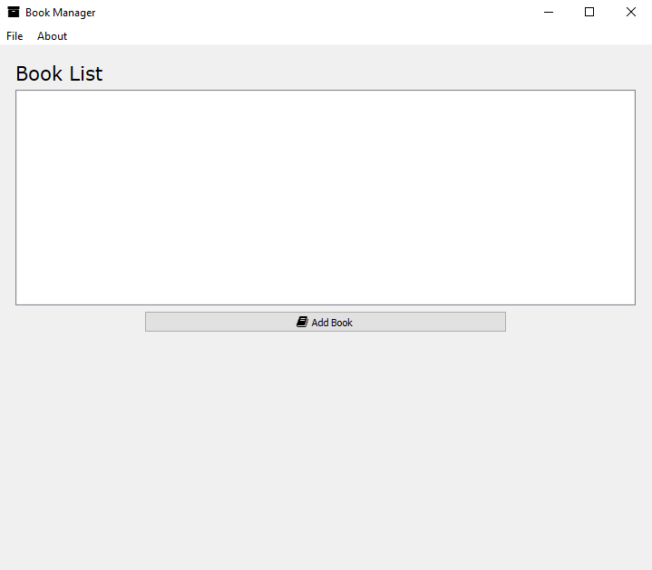

# PyQt5 Book Manager

A desktop application built with PyQt5 for managing a collection of books. Users can add books and manage pages within each book. The application uses SQLAlchemy for database interactions and integrates custom widgets for a user-friendly experience.

## Screenshots

.png)

.png)

.png)

## Features

* **Add Books** : Add new books with titles and cover images.
* **View Books** : Display a list of books with their cover images.
* **Manage Pages** : Add, view, and edit pages for each book.
* **Add and Load More Pages** : Load and navigate through multiple pages of content.

## Requirements

* Python 3.6 or higher
* PyQt5
* SQLAlchemy
* qtawesome

## Installation

1. **Clone the Repository** :
   `https://github.com/PythonShinobi/Book-Manager.git`
2. **Create a Virtual Environment:**
   `python -m venv venv`
   `source venv/bin/activate`  # **On macOS/Linux**
   `venv\Scripts\activate`  # **On Windows**
3. **Install Dependencies** :
   `pip install -r requirements.txt`

## Usage

**Run the Application** :

`cd src`

`python main.py`

## Acknowledgments

* **PyQt5** : For the GUI framework.
* **SQLAlchemy** : For ORM functionality.
* **qtawesome** : For icons and other GUI enhancements.
